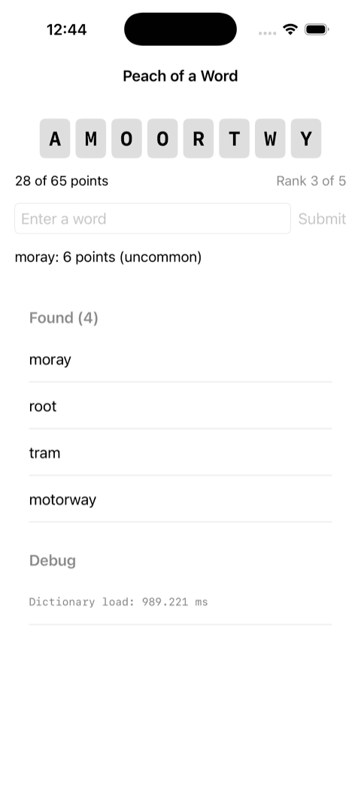

# peach-of-a-word-swift

An experiment, deliberately timeboxed. Not a product, not a v2.

It ports the pure engine of Peach of a Word — scoring, rarity classification,
the tier ladder, completion, the daily calendar lookup, and puzzle construction
— from TypeScript to Swift, to find out two things: whether writing Swift is
enjoyable, and how fast that actually goes. The engine was chosen because it is
pure, framework-free, and fully unit-tested, so its existing test suite is an
executable spec. That makes this an exercise in learning one thing (Swift)
rather than two.

**The web repo stays canonical.** Nothing here feeds back into it. The word
lists in `Data/` are a frozen snapshot, not a sync — see [SNAPSHOT.md](SNAPSHOT.md)
for the date, the source commit, and one way the upstream metadata has already
drifted from the files it describes.

No UI, no persistence, no audio, no theming, no data pipeline. Those are the
rewrite half and are explicitly out of scope.

There are two parts. **Part one** ported the engine and asked whether Swift was
workable. **Part two** is the smallest possible SwiftUI app on top of it, which
asks the question part one deliberately did not: what does working on a native
project look like, and could this ship?

The result of both is [docs/REPORT.md](docs/REPORT.md), written from
[docs/PORT-LOG.md](docs/PORT-LOG.md). The port log doubles as a reading list of
Swift and SwiftUI concepts with no TypeScript equivalent.



## Running it

```bash
swift test                              # the ported engine suite, 84 tests
swift run -c release peach-bench        # dictionary load + letter-count timings

# The app. Regenerate the project only if you change project.yml.
xcodegen generate
xcodebuild -project PeachOfAWord.xcodeproj -scheme PeachOfAWord \
  -configuration Release \
  -destination 'platform=iOS Simulator,name=iPhone 17 Pro' build
```

The app takes a `-guesses word1,word2` launch argument that submits words at
startup, so the whole loop can be driven without typing into the simulator.

Release mode matters for the benchmark: debug Swift string and collection work
is often around 10x slower, and a debug number would argue for a different
storage format on a lie.

Requires Swift 6.0+. The package targets **macOS 14 and iOS 17**; the iOS floor
is set by the app's use of `@Observable` and `ContentUnavailableView`, not by the
engine. It was briefly macOS 26 / iOS 26, which only `InlineArray` required. See
"The deployment floor" in [docs/MEASUREMENTS.md](docs/MEASUREMENTS.md).

## Licence

MIT. See [LICENSE](LICENSE).
