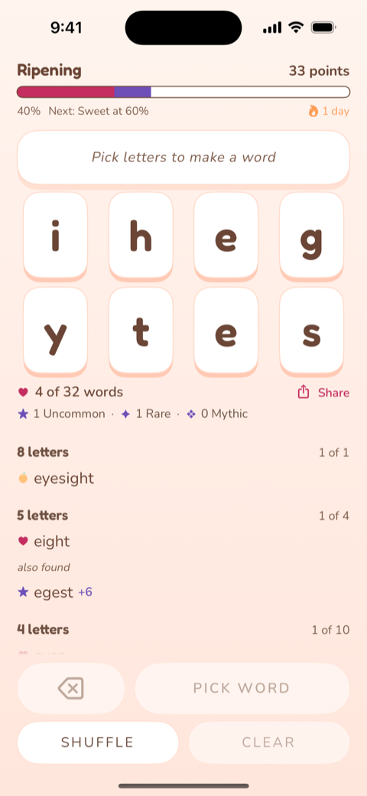

# peach-of-a-word-swift

A native iOS version of [Peach of a Word](https://github.com/anthony-liddle/peach-of-a-word),
a daily word game. Make words from eight letters, then find the source word they
all came from.

One puzzle a day, shared by everyone playing. Tap letters to build a word, find
the common words the rack can spell to climb the tier ladder, and find the
eight-letter source word itself for the game's other moment. Progress and streak
survive a force quit, the day rolls over at local midnight, and a finished day
can be shared as a spoiler-free block of squares.

Built in SwiftUI on top of `PeachEngine`, a pure Swift package holding scoring,
rarity classification, the tier ladder, completion, the daily calendar lookup and
puzzle construction. The engine has no UI, no I/O and no framework dependencies,
which is why it carries 102 tests and the app carries none.

**The web repo stays canonical.** Nothing here feeds back into it. The word lists
in `Data/` are a frozen snapshot, not a sync. See [SNAPSHOT.md](SNAPSHOT.md) for
the date, the source commit, and one way the upstream metadata has already
drifted from the files it describes.



## Running it

Requires Swift 6.0+ and Xcode. The package targets **macOS 14 and iOS 17**. The
iOS floor comes from the app's use of `@Observable` and `ContentUnavailableView`,
not from the engine.

```bash
# The app. Regenerate the project only if you change project.yml.
xcodegen generate
xcodebuild -project PeachOfAWord.xcodeproj -scheme PeachOfAWord \
  -configuration Release \
  -destination 'platform=iOS Simulator,name=iPhone 17 Pro' build

swift test                              # the engine suite, 102 tests
swift run -c release peach-bench        # dictionary load + letter-count timings
```

`PeachOfAWord.xcodeproj` is committed as well as generated, so the repo opens in
Xcode without XcodeGen installed. Project settings are therefore **not** editable
through Xcode's UI: anything set there is discarded the next time
`xcodegen generate` runs. Change `project.yml` instead. Source files under `App/`
and `Sources/` are unaffected.

Xcode Cloud does not rely on the committed project. `ci_scripts/ci_post_clone.sh`
regenerates it from `project.yml` on every build and fails the build if it
cannot, so `project.yml` is authoritative and the committed `.xcodeproj` is a
convenience for opening the repo. That script also sets the build number from
`CI_BUILD_NUMBER`; local builds keep the number committed in `project.yml`.

Release mode matters for the benchmark. Debug Swift string and collection work is
often around 10x slower, and a debug number would argue for a different storage
format on a lie.

Debug builds take launch arguments that drive the game without typing into the
simulator, including `-guesses word1,word2` to submit words at startup and
`-dayOffset N` to move the calendar. All of them are behind `#if DEBUG` and are
unreachable in a release build.

## How it started

This began as a deliberately timeboxed experiment: port the engine from
TypeScript to Swift, tests first, and find out whether writing Swift was
enjoyable and how fast it actually went. It was explicitly not a product. That
framing is now out of date, because it shipped and is being played daily.

The experiment record is kept rather than rewritten:

- **[docs/REPORT.md](docs/REPORT.md)** is the result, including what the port
  cost, where Swift's strictness paid for itself and where it did not, four bugs
  the port surfaced in the web repo, and what stood between a working engine and
  a shipped app.
- **[docs/PORT-LOG.md](docs/PORT-LOG.md)** is the running log, and doubles as a
  reading list of Swift and SwiftUI concepts with no TypeScript equivalent.
- **[docs/MEASUREMENTS.md](docs/MEASUREMENTS.md)** holds the timings, including
  the dictionary load on a real phone and why the deployment floor moved.

Those documents describe the repository as it was at the end of the port, when
there was no UI, no persistence and no theming. They are a record of how it went,
not a description of what is here now.

## Attribution

The word lists are ENABLE (public domain) and SCOWL, and the typefaces are
Fredoka and Nunito under the SIL Open Font License. SCOWL and the OFL both
require their notices travel with the files, so those notices are reproduced in
[ATTRIBUTION.md](ATTRIBUTION.md) and in `App/Fonts/`.

## Licence

MIT. See [LICENSE](LICENSE). This covers the code in this repository, not the
bundled word lists or fonts, which carry their own terms.
